# Event API

## Targeted Scope, Processes and Technology
Event API has been driven primarily by participating shipping lines since the October 2018 workshop under OpenShipping.org. The majority of the content has been agreed among all OpenShipping.org participants – importantly decisions about which existing standard to build upon (listed on a later slide). 

But the shipping lines’ focus in establishing the Event API is specifically based upon use cases around: 

* Shipping milestone planning and execution,
* Shipping events, particularly such generated by emerging IoT device technologies

In the spirit of OpenShipping.org, our technical starting point is naturally modern HTTP-based API technologies. 

Functionally, our ambition has been to specify a design which: 
* Is common among participating carriers’ booking, planning and operational processes. 
* Doesn’t deviate significantly from known back office systems, ensuring that subsequent data mapping is manageable.
* Is rooted in – and builds upon – existing standards.
* Breaks down barriers to entry by applying generic, logical models and self-explanatory naming. 

Common for the targeted use cases, legacy systems and emerging IoT devices is that communication is event-driven. What this means is that a heterogeneous landscape of actors (human, organizations, devices, etc) emit statuses on a near-real time, best-effort basis. Similarly, a heterogeneous landscape of actors receive and react on these events. The individual event aims to communicate what has happened, but does not imply how this information is to be used – it is left to the receiver how to action received events, including keeping state.
This is in contrast to other communication paradigms, notably REST, which is very commonly implemented over APIs, leveraging HTTP’s verbiage for also communicating how data is intended to be stored and manipulated. This is a very practical pattern in many situations, but less suitable for the targeted use cases in the heterogeneous landscape of shipping. Practically, this results in an all HTTP POST API, requiring business logic to properly react. As mentioned above, 1) such business events exist in legacy systems throughout the industry, and 2) significant emphasis has been put on the aspects of genericness, logic and simplicity. 

Please note that the current version of the API is a baseline, not necessarily a final version. It covers the particular scope just described, and there is obviously many other aspects to global transport and trade which may be added in future releases. 

### UN/CEFACT Foundation
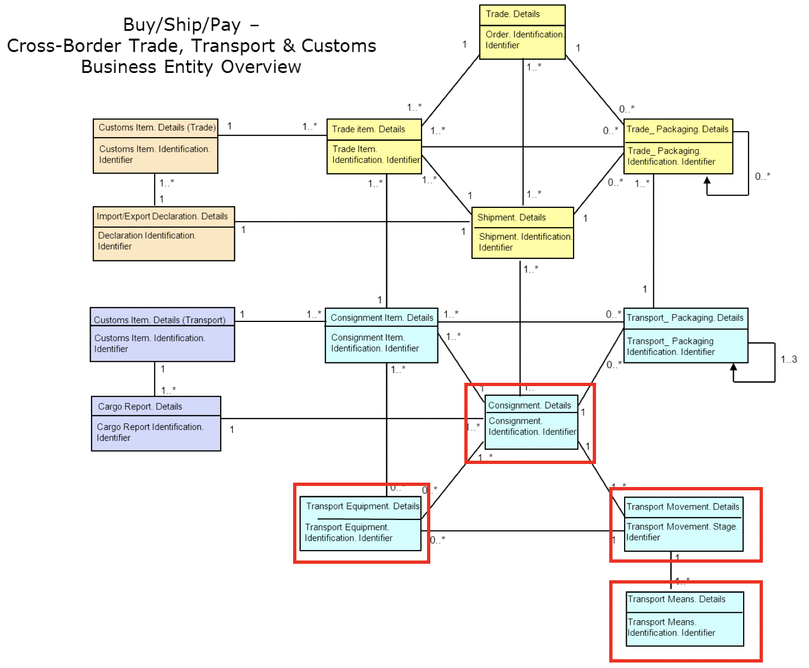
The Event API allows for publishing Consignments and Transport Equipment as events through a POSTing alongside the events, meant to serves as the context of those subsequent events. 

These are direct implementations of the Consignment and Transport Equipment classes of the UN/CEFACT Supply Chain Reference Data Model (SCRDM)’s Buy-Ship-Pay model. The Consignment represents the contract of transport and the Transport Equipment used for that transport – all of interest to varying parties involved at each level. 

These form a hierarchy, with Transport Equipment sitting underneath a Consignment. Consignment also hold parties. Planned events relate to Consignments; Estimated and Actual events relate to Transport Equipment. 
From the perspective of common carrier business processes, the Consignment roughly represents the booking confirmation, whereas the Transport Equipment represents the equipment matching (when a physically identified container has been assigned to the consignment). 

Shipment plays an important role, but has not yet been included in this first version of the API entirely due to scope confinement. The Shipment class represents the traded of goods inside the containers, and are of important relevance to authorities, financial institutions, sellers and sellers. It is worth noting that LCL tracking should be done through the Shipment class, so the current version of the API is only meant to deal with FCL. We consider adding the Shipment class a natural future extension of the API. 

It is also worth pointing out that consignments are commonly referred to as “shipments” in the carrier business (because carriers don’t need to distinguish). However, in order to accommodate the larger industry, and for general clarity, we fully embrace UN/CEFACT’s clear definitions, explicitly distinguishing between Trade Data (yellow) and Transport Data (blue). 

Movement and Means are implemented in the Milestone events. Both are represented in the resource model, available through the Milestone event endpoints. 

### Additional Adopted Standards
* **UN/CEFACT Smart Container project under transports and logistics** for tracking and monitoring physical trip execution, implemented in the SmartEvent endpoints. 
* **UN/CEFACT Code List recommendation 24**, supported through the generic events. 
* **UN/Locode**, implemented at attribute level for geographical locations
* **SMDG**, implemented at attribute level for terminal identification
* **IMO**, implemented at attribute level vessel identification
* **ISO 8601**, implemented at attribute level for time and timezone representation
* **ISO 6346**, implemented at attribute level for container identification

### Event Flow Example
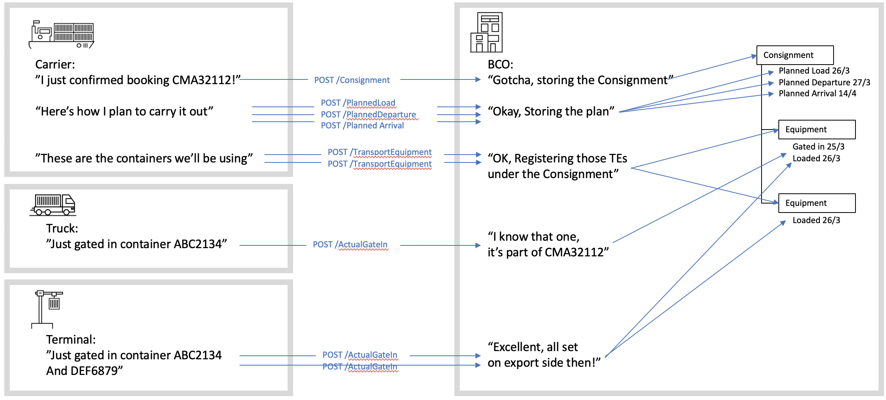

### Endpoint Overview
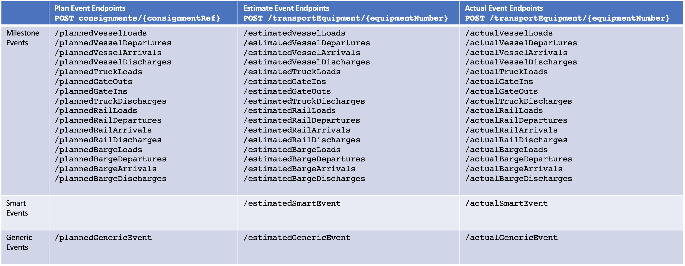

### Where Events Occur
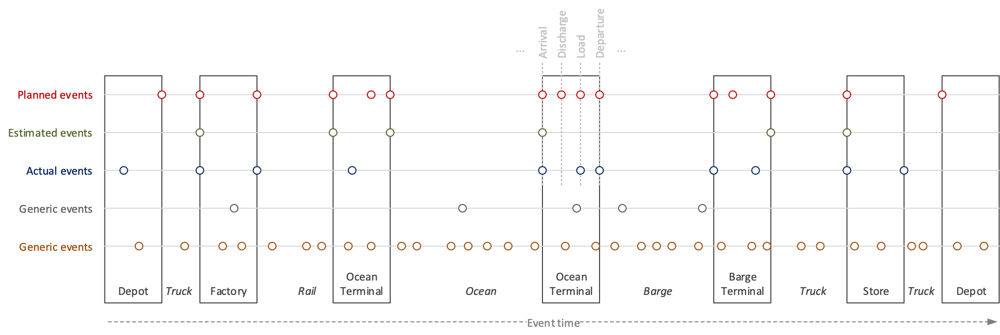
* All Milestone events occur within a defined location (UNLOCODE location and SMDG Terminal). 
* Smart Events occur continuously along each leg (GPS Coordinates), between locations.
* Generic Events may not relate to any kind of location at all.

## Milestone Events

### Milestone Event Introduction
The Milestone events are modular, and can model any Consignment’s multi-modal transport plan. This reflects the various locations which the Equipment needs to moving move between for contractual and operational purposes. 
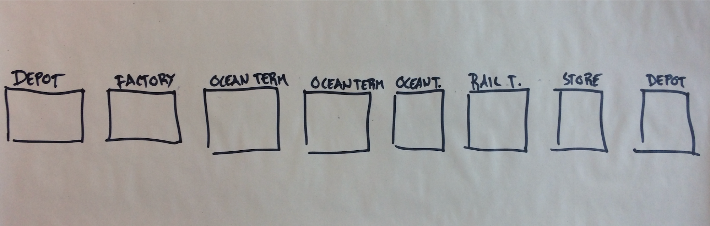

Equipment is moved between locations by various means of transport. Such “legs” can be considered the edges connecting location nodes.  
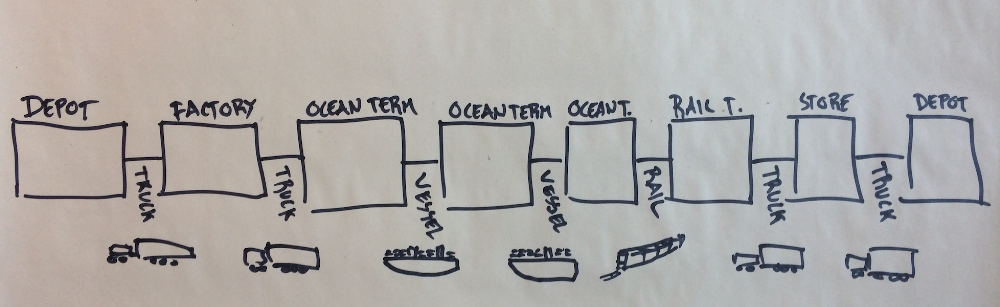

Each leg are represented consistently as four distinct, key milestone events representing how containers are first *loaded*, then *departs* from one location, *arrives* at a different location, and is *discharged* from that means of transport. This cycle is repeated for each leg of the transport plan. 

Through the journey, the container changes status, from *export* to *import*, and *empty* to *full* and then again *empty*. These statuses are represented as attributes on the events. 

Finally, each event comes in three types: *planned*, representing how the carrier intends to carry out the transport, *estimated*, which can be signaled along the way (not shown below), and *actual*, when the milestone event has been carried out. 
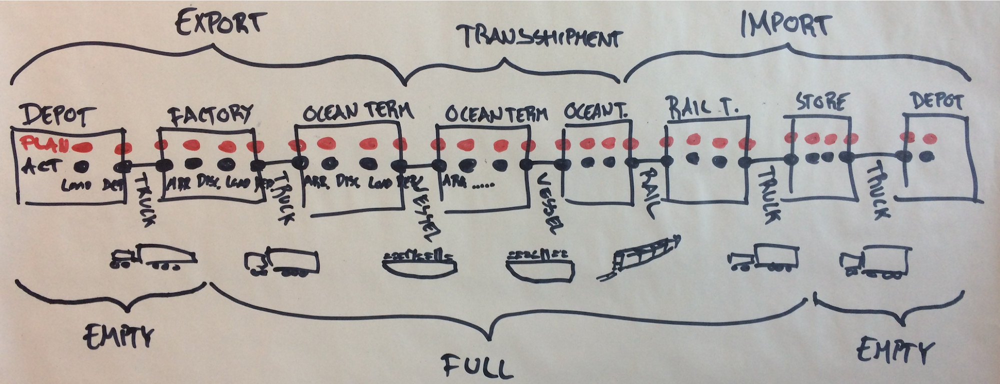

### Milestone Event Model

A transport plan Leg is described by four events: 
* Load
* Departure
* Arrival 
* Discharge

Each, in turn, come in three flavors: 
* Planned – what is supposed to happen
* Estimated – what and when events are expected to happen
* Actual – what has indeed happened

This results in 12 distinct events per leg type: 
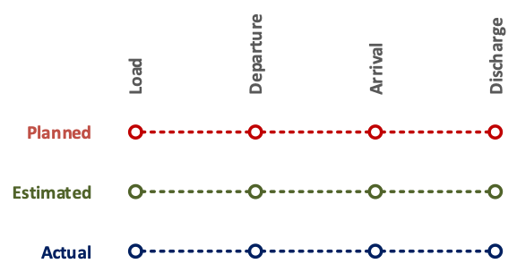

Legs are joined together to form a full transport plan. Leg-joining happens at terminals.
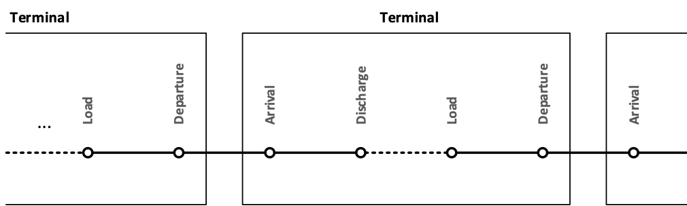 
Note that Planned events relate to Consignments, whereas Estimates and Actuals relate to Equipment. This reflects that carriers plans for the full consignment, but containers are in reality moved individually. 

There are individual events for each type of leg: 
* Truck 
* Rail
* Barge
* Vessel
The event model thus consists of a total of 48 events: 
 
This model is easily extensible (e.g. adding an “Air” leg type). 

While the milestone event model is based on this strict logical, where appropriate the naming of individual events are made to embrace common industry lingo. E.g. “Gate out” instead of ”Truck departure”. 

### Milestone Event Example
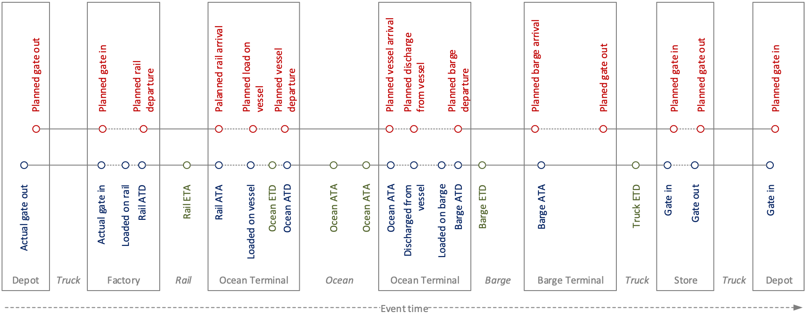

## Schema Data Model
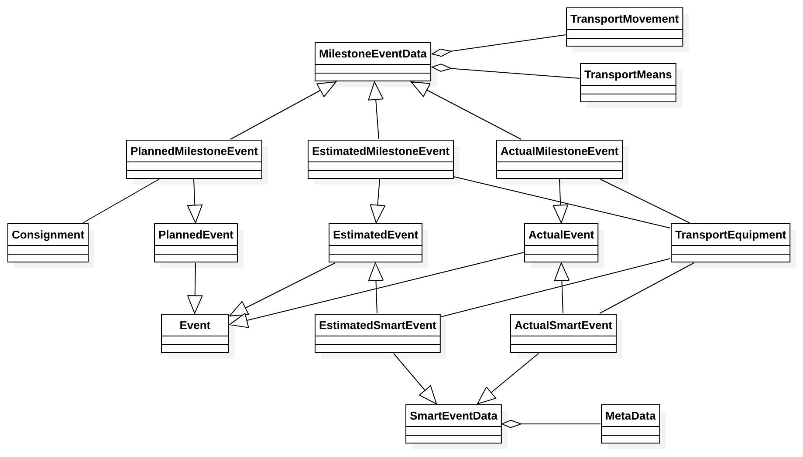

### Data Model Documentation 
The section describes the attributes contributed by each schema defined in the Event API OpenAPI specification. 

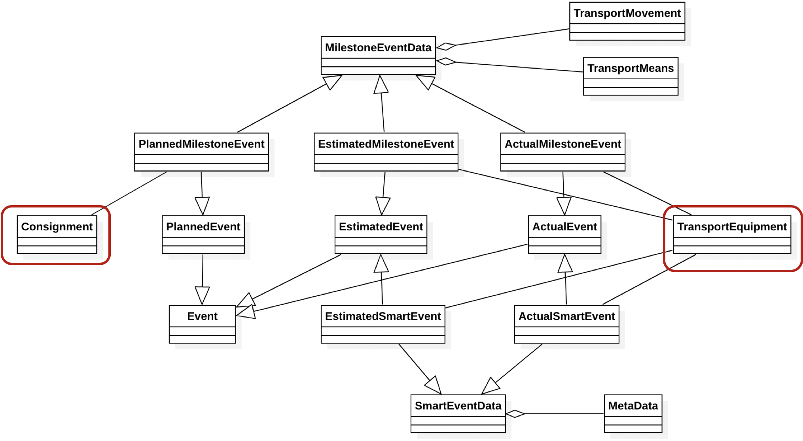

Consignnment and Transport Equipment data serve as context of the tracking events.

#### Consignment
A consignment is a separately identifiable collection of Container Transports (available to be) transported from one Consignor to one Consignee via one or more modes of transport as specified in one single transport service contractual document.

#### TransportEquipment
A piece of equipment used to hold, protect or secure cargo for logistics purposes. Transport Equipment are assigned to consignment when its transport execution starts.

#### Event
The model relies on a main generic entity “Event” which provides a generic pattern to describe a tracking event.
Two types of events will be described later: Milestones & Smart Events.

**eventCodeType**
`string`
This can link to coded event standards, such as 'EDIFACT' or 'CEFACT Recommendation 24'.
example: CEFACT Recommendation 24

**eventCodeValue**
`string`
The code as per the above codification scheme. 
example: 359

**eventCodeDescription**
`string`
Description as per the codeification scheme. 
example: Bill of Lading issued

**eventTime**
`string($date-time)`
Time of the event occurrance, in ISO 8601 format

**originatorId**
`string`
SCAC code of the organization that published this event

**correlationId**
`string`
‘Technical’ User-supplied ID for this event

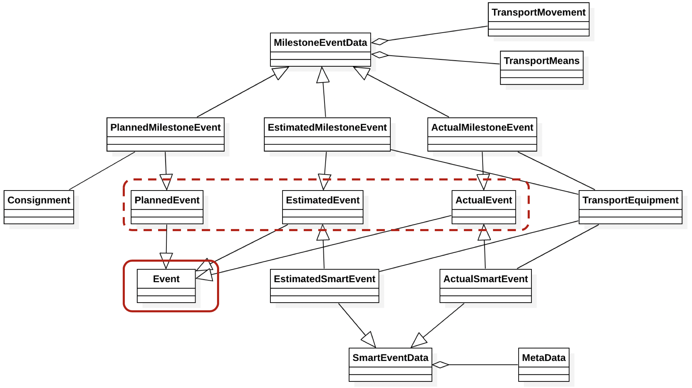
#### PlannedEvent
Planned events are submitted by the carrier, responsible for executing a consignment as per the agreement of the booking.
A consignment trip plan might be updated (e.g. due to route change), and thus planned events could be grouped according to a plan reference or revision.

**consignmentRef**
`string`
Consignment identifier, carrier assigned reference number assigned by a carrier of its agent to identify a specific consignment such as a booking reference number when cargo space is reserved prior to loading. "BN" as defined in http://www.unece.org/fileadmin/DAM/trade/untdid/d16b/tred/tred1153.htm
 This property allows to link the event to a consignment context.

**planRef**
`string`
Common reference used across a set of planned events, in order to associate them to the same plan.

####EstimatedEvent
Estimated events can be submitted by participants of the consignment execution. They represent how the planned events are expected to be executed. 
An estimated event is related to one of the transport equipment. It might affect the consignment plan, but it does not automatically change it.

####ActualEvent
Actual events register details of events which has already been occurred.

**equipmentNumber**
`string`
ISO 6346 goverend number, physically printed on the equipment. This represents UN/EDIFACT's "EQ" code. Number assigned by the manufacturer to specific equipment. (http://www.unece.org/fileadmin/DAM/trade/untdid/d16b/tred/tred1153.htm)
This property allows to link the event to a transport equipment context.

**gpsLocation**
The GPS coordinates of event location (longitude, altitude)

#### Planned/Estimated/Actual MilestoneEvents
Milestones events inherit from generic events, with additional specific “MilestoneEventData”

**location**
`string`
The UN/LOCODE where the event occurred. example: AUSYD

**terminal**
`string`
SMDG code of the terminal where the event took place. example: USMOB-APMTSMDG 

**transportationPhase**
`string`
The transportation phase. example: Import

**fullStatus**
`string`
Indication of whether the container is full or empty. example: Full

**Transport Movement**
`Object`
The conveyance (physical carriage) of goods or other objects used for logistics transport purpose. It includes:
* **vehicleId**: Identification of the means of transport. Use IMO numbers for vessels and barges
* **vehicleType**: Truck, Vessel, Rail, Barge, Air

**Transport Means**
`Object`
The devices used to convey goods or other objects from place to place during logistics cargo movements. It includes:
* **transportReference**: A transport reference like Transport Order, Visit number (sequence in the tour for rail transportation), or Voyage number for vessels.

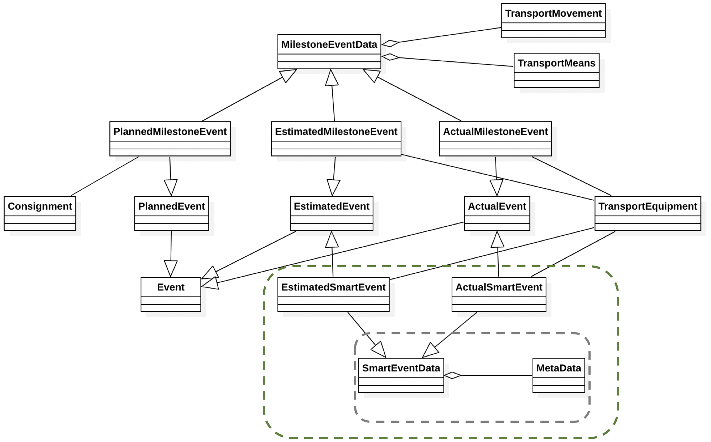

####Estimated/Actual SmartEvents
Smart containers equipped with new technologies such as IoT can send “smart events” to transport participants.
Smart events are ‘actual’, and could be ‘estimated’ if the smart container is ‘aware’ of its transport context and able to analyze it. 

**metaData**
metadata related to smart events:
* **assetId**: Container number
* **assetType**: Asset type. For instance, 'DRY' or 'Refeer'
* **deviceId**: Id of the IOT device used for asset tracking
* **generationTimestamp**: Generation timestamp of the eventsoftware: Name of software used for posting event
* **softwareVersion**: Software version
* **eventDetail** ‘free’ Object.

Smart event may carry  additional data, such as:
* physical reefer measurements – for reefer monitoring,
* out of range values – for reefer alerting
* Location details – for geofencing.
* ...

This ‘generic’ object will be specified later, based on outputs of smart container project (i.e. codification of smart events and their data model). 

### Linkage to Endpoints

This diagram illustrates the relationship between endpoints and their payloads
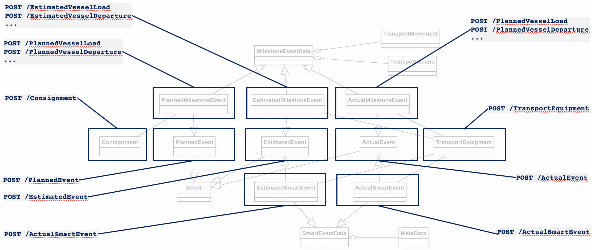

